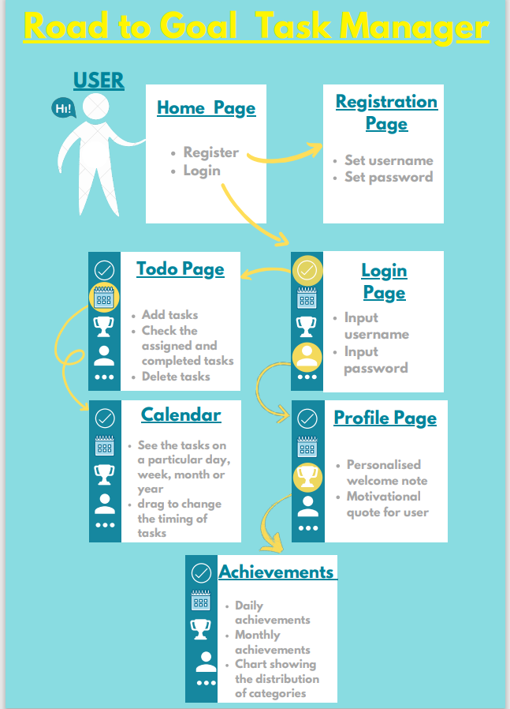

# RoadToGoal--Task-tracker-Website

  
  

  The website “Road To Goal” is a task managing website. It is a user friendly website which
helps the users to keep track of the tasks they need to do and follow up on it later. First of all the users
have to register by creating an account. After registration they can login using their own user id and
password. The first page that appears after login is the home page. Each time a user signs in, they see
different motivational quotes. In the to-do page, one can add tasks, check it once completed and remove it
from the list. All the changes will be reflected in the database as well as in the calendar. The events
mentioned will be seen in the calendar and users can adjust the timings of the day just by scrolling over
the mentioned day. The achievement page contains real time graphs which helps the user to check out
their daily and weekly progress.
